# Confluence Markdown Viewer

[](https://github.com/alecchen/confluence-markdown-viewer/actions/workflows/ci.yml)

A static, reusable Markdown viewer for embedding in Confluence. Markdown stays the single source of truth in Git; this repo is only the renderer.

- No build step — the served site is plain static HTML/CSS/JS (`lib/` holds the parser and highlighter, copied verbatim from npm; dev-only test tooling lives in `package.json`, never deployed).
- marked.js + highlight.js vendored in `lib/`, served same-origin. jsDelivr is blocked in the Confluence environment and a public-CDN fetch per lib costs a connection before anything renders. Mermaid is the one remaining CDN dependency — 1MB, loaded lazily, only for docs with a diagram.
- GitHub-flavored Markdown styling, GitHub-style tables.
- Confluence-style heading links: hover a heading and click the chain icon to copy a link to that section.
- Solarized code highlighting.
- System font stacks (no webfonts): native UI/Helvetica for text, ui-monospace/Menlo for code.
- Confluence theme detection (via the embed script) with browser `prefers-color-scheme` fallback.
- Dynamic light/dark switching without reload; manual override persists in localStorage.
- Link hover preview: attach a thumbnail to any link with `"preview:image.png"` in the title — a small preview appears on hover.
- Draft → publish: only `published/` is ever served; drafts never leave a draft repo outside the web root.

## Layout

```
public_html/username/
  viewer/              <- this repo (clone)
    viewer.html        <- the viewer: one reusable page
    css/viewer.css
    js/viewer.js
    lib/               <- marked, marked-gfm-heading-id, highlight.js (vendored, same-origin)
    published/         <- served markdown (gitignored; plain files, NFS-backed)
    .htaccess          <- deny /.git/ and dotfiles
  drafts/              <- separate git repo, drafts only (outside web root)
```

## Deploy

On the Linux VM, clone into the web root and pull to update:

```sh
cd ~/public_html/username
git clone <this repo URL> viewer
cd viewer && git pull
```

After the first deploy, verify the `.git` deny (see Security).

## Publish workflow

Drafts live in their own git repo at `~/drafts`, outside the served tree. The served
`published/` folder is gitignored here and backed up by NFS snapshots. Publishing is
a pre-commit hook that copies the staged draft into the served tree, so
"commit a draft" = "it is live":

`~/drafts/.git/hooks/pre-commit`:

```sh
#!/bin/sh
set -e
DEST="$HOME/public_html/username/viewer/published"
mkdir -p "$DEST"
for f in $(git diff --cached --name-only); do
  case "$f" in
    *.md|*.png|*.jpg|*.jpeg|*.gif|*.svg|*.webp|*.pdf|*.txt|*.csv|*.zip)
      mkdir -p "$DEST/$(dirname "$f")"
      cp "$f" "$DEST/$f" ;;
  esac
done
```

Make it executable (`chmod +x`). Write/edit drafts in VS Code over SSH, preview there,
then `git commit` to publish. The draft repo keeps file history; NFS snapshots are the
rollback for the served copies. Folders are preserved, so an image at `images/x.png`
in the draft lands at `published/images/x.png`.

## Images and attachments

Keep assets next to the markdown (or in a subfolder) and reference them with
relative paths — the viewer resolves them against the markdown file's directory:

```md

[report](report.pdf)
```

With `?src=published/foo.md`, `images/architecture.png` resolves to
`published/images/architecture.png`. Only the extensions listed in the publish
hook are copied to the served tree; add others to the `case` list if you need them.

### Link hover preview

Attach a thumbnail to any link by adding `"preview:<image path>"` as the title.
On hover, a small preview image appears near the cursor. Links without this title
work exactly as before — the feature is purely opt-in per link.

```md
[slides](slides.pdf "preview:slides-cover.png")
[report](report.pdf "preview:report-thumb.png")
[external](https://example.com/deck "preview:https://cdn.example.com/thumb.png")
```

Relative paths resolve against the markdown file's directory, the same way images
and other assets do. The thumbnail must be one of the published asset types
(png, jpg, gif, svg, webp) so the publish hook copies it to `published/`.

The preview is hidden on touch devices (no hover) and closes on `Esc` or when the
cursor leaves the link. In the Confluence iframe embed, the thumbnail pins itself
to the visible viewport, just like the image lightbox.

### Sizing images

CommonMark has no way to set an image's size, so the viewer adds two
extensions:

| Syntax | Result |
| --- | --- |
| `` | 50% of the content column |
| `` | exactly 100px wide |
| `` | 50px wide (Obsidian style) |
| `` | 50% of the content column |

`=width` goes after the destination (keep a space before `=`). The Obsidian
style rides in the alt text, where `|50` means pixels and `|50%` means percent.
The size is emitted as an HTML `width` attribute, and the CSS `max-width: 100%`
cap on images still applies.

To see the same sizes in VS Code's built-in markdown preview while writing
drafts, install the bundled `vscode-image-size/` extension (see its README). A
test keeps the two implementations' output identical.

## Embed in Confluence

Paste this into the HTML macro on the target page (change the `?src=` path per doc):

```html
<iframe id="mdv" src="https://people.my_company_url.com/username/viewer/viewer.html?src=published/foo.md"
        scrolling="no" allow="clipboard-write"
        style="width:100%;border:0;display:block;overflow:hidden;"></iframe>
<script>
(function () {
  var f = document.getElementById('mdv');
  var childOrigin = new URL(f.src).origin;   /* derived from the iframe URL, no hardcoding */
  var lastBg = null;

  function luminance(c) {
    var m = c.match(/(\d+(?:\.\d+)?)/g);
    if (!m || m.length < 3) return 255;
    return 0.299 * (+m[0]) + 0.587 * (+m[1]) + 0.114 * (+m[2]);
  }
  function pageBg() {
    var el = document.body;
    while (el) {                              /* walk up past transparent bodies */
      var c = window.getComputedStyle(el).backgroundColor;
      if (c && c !== 'rgba(0, 0, 0, 0)' && c !== 'transparent') return c;
      el = el.parentElement;
    }
    return null;
  }
  function build() {
    var bg = pageBg();
    var dark = bg ? luminance(bg) < 128 : window.matchMedia('(prefers-color-scheme: dark)').matches;
    var s = window.getComputedStyle(document.body);
    var a = document.body.querySelector('a');
    return {
      type: 'mdv-theme',
      theme: dark ? 'dark' : 'light',
      bg: bg || (dark ? '#1d2125' : '#ffffff'),
      fg: s.color || (dark ? '#b6c2cf' : '#172b4d'),
      link: a ? window.getComputedStyle(a).color : (dark ? '#579dff' : '#0052cc')
    };
  }
  function sendNow() {
    var m = build();
    if (m.bg === lastBg) return;              /* only push on an actual change */
    lastBg = m.bg;
    f.contentWindow.postMessage(m, childOrigin);
  }
  var t = null;
  function schedule() { clearTimeout(t); t = setTimeout(sendNow, 120); }

  sendNow();
  f.addEventListener('load', sendNow);
  /* re-sync live when Confluence toggles its theme */
  new MutationObserver(schedule).observe(document.documentElement, { attributes: true });
  new MutationObserver(schedule).observe(document.body, { attributes: true });
  window.matchMedia('(prefers-color-scheme: dark)').addEventListener('change', schedule);
  setInterval(sendNow, 1500);                 /* safety net for any toggle mechanism */

  window.addEventListener('message', function (e) {
    if (e.origin !== childOrigin) return;
    var d = e.data;
    if (!d) return;
    if (d.type === 'mdv-height') f.style.height = d.height + 'px';
    if (d.type === 'mdv-scroll') {           /* TOC jump: scroll the page to the heading */
      var r = f.getBoundingClientRect();
      window.scrollTo(0, window.pageYOffset + r.top + d.top - 80);
    }
    if (d.type === 'mdv-viewport-request') postMdvViewport();
  });
  /* Heading deep links: the copied link is <this page>#<heading id>. The heading
     lives inside the iframe, so relay the hash to the viewer, which scrolls the
     iframe and asks us to scroll the page to it. */
  function relayHash() {
    var h = (location.hash || '').slice(1);
    if (h) f.contentWindow.postMessage({ type: 'mdv-hash', id: h }, childOrigin);
  }
  relayHash();
  window.addEventListener('hashchange', relayHash);
  f.addEventListener('load', relayHash);
  /* The viewer builds heading copy-links from this page's URL. A browser's
     referrer is often trimmed to the origin, so send the full URL explicitly. */
  function sendPageUrl() {
    f.contentWindow.postMessage({ type: 'mdv-parent-url', url: location.href }, childOrigin);
  }
  sendPageUrl();
  f.addEventListener('load', sendPageUrl);

  /* Image lightbox: the iframe is sized to the full doc height, so a fixed
     overlay would center below the fold. Relay which slice of the iframe is
     visible so the viewer can pin its overlay to the on-screen area. */
  var mdvRaf = 0;
  function postMdvViewport() {
    if (mdvRaf) return;
    mdvRaf = requestAnimationFrame(function () {
      mdvRaf = 0;
      var r = f.getBoundingClientRect();
      var top = Math.max(0, -r.top);
      var height = Math.min(window.innerHeight, f.offsetHeight - top);
      if (height < 0) height = 0;
      f.contentWindow.postMessage({ type: 'mdv-viewport', top: top, height: height }, childOrigin);
    });
  }
  window.addEventListener('scroll', postMdvViewport, { passive: true });
  window.addEventListener('resize', postMdvViewport);
  postMdvViewport();
})();
</script>
```

Note: in the HTML macro, every `&` inside the iframe `src` must be written as
`&amp;` (e.g. `viewer.html?src=published/foo.md&amp;toc=1`). A bare `&` makes
Confluence's parser warn `EntityRef: expecting ';'`; the browser decodes `&amp;`
back to `&` when it loads the URL.

The `<script>` is optional but recommended: it matches the rendered doc to the
Confluence page theme (background color, text color, link color), keeps the iframe
exactly as tall as its content (no nested scrollbars), and **re-syncs live when
Confluence toggles between light and dark** — only pushing an update when the page
background actually changes. It also relays the iframe's visible slice, so the image
lightbox centers in the on-screen area instead of below the fold. Origins are
derived from the iframe URL and the referrer, so no hostnames need configuring -
only the `src` above must point at your real viewer URL.

It also makes heading deep links work: copied heading links target this page with the
heading id as a hash, and the script relays that hash to the viewer so the page opens
scrolled to the heading. The script also sends this page's full URL to the viewer,
since a browser's referrer is often trimmed to just the origin.

Content links in the markdown (external or relative) open in a new tab, so clicking
one never navigates the embedded iframe away from the Confluence page. Fragment links
(`#...`, including TOC entries) stay in-frame so the viewer can scroll to them.

## Theme model

- **Default (B — Confluence):** the embed script reads Confluence's computed
  background/text/link colors and theme, and the viewer applies them. Borders,
  table headers and muted text are derived from the text color by alpha.
- **Optional (A — GitHub):** fixed GitHub palette, enabled per-doc via
  `?preset=github`.
- **Fallback:** if no parent message arrives (viewer opened directly, or testing on
  GitHub Pages), the viewer uses the browser theme with the GitHub palette.
- **Manual override:** the small pill at the top-right cycles auto → light → dark and
  persists in localStorage.
- **Code:** GitHub palette in light, Nord in dark (the defaults). Other schemes via
  `?code=` — `github`, `nord`, `solarized`, `one-dark`, `atlassian` — an explicit
  choice applies to both themes. Block and inline code colors follow the resolved
  theme.

## Viewer parameters

- `?src=published/foo.md` — which markdown to render (relative to `viewer.html`;
  same origin, so no CORS).
- `?preset=github` — force the GitHub palette (A) for this doc.
- `?theme=light|dark|auto` — force a theme for this load.
- `?toc=1` — show a table of contents at the top of the doc. Every `h1`–`h6`
  gets a GitHub-style anchor id (via `marked-gfm-heading-id`); the heading's
  chain icon (on hover) copies a link to that section. Standalone, the copied
  link points at the viewer; in the embed it points at the Confluence page plus
  the heading id, and the embed script relays the hash so the page opens scrolled
  to the heading. In the embed, TOC links ask the parent to scroll the Confluence
  page to that heading.
- `?code=github|nord|solarized|one-dark|atlassian` — code block colors. Default is
  `github` in light, `nord` in dark; an explicit scheme applies to both themes.
  E.g. `viewer.html?src=published/foo.md&code=nord`.

## Code blocks and diagrams

- Every code block gets a **Copy** button (top-right, on hover; always visible on
  touch). Copying uses `navigator.clipboard` with a legacy fallback, so the embed
  block needs the `allow="clipboard-write"` attribute on the iframe.
- Tag a fence with its language (```` ```js ````) to get syntax colors. A fence with
  no language tag renders as plain code: highlight.js would otherwise *guess* at
  the language, which means running every one of its 36 grammars over the block,
  and a long log dump costs ~130ms of blocking work before the doc can paint (see
  Performance). Untagged blocks keep the code background and the Copy button.
- Fenced blocks tagged ```` ```mermaid ```` render as diagrams. Mermaid (cdnjs) loads lazily only when a
  doc contains a mermaid block, and re-renders when the page theme toggles.

### Gantt time zones

Mermaid gantt has no time-zone concept: with `dateFormat HH:mm` every clock is read
against the browser's own day, so a chart written in one zone shows the wrong hours
in another. Add a comment inside the fence to say which zone the clocks are written
in, and the viewer puts a zone picker above that diagram:

````md

```mermaid
gantt
dateFormat HH:mm
axisFormat %H:%M
%% tz-base: +08:00
section warm
TTFT   :done, t1, 09:00, 09:14
Decode :done, t2, 09:14, 09:52
```

````

The picker defaults to the reader's own zone, so the chart opens showing their local
hours, and any other zone can be selected from it. `tz-base` takes either a fixed
offset (`+08:00`, `UTC+08:00`, `GMT+0800`) or an IANA name (`Asia/Shanghai`,
`America/Los_Angeles`), resolved through `Intl` for the date being charted, so DST is
handled per zone rather than as a fixed hour count.

Only the clocks move: each task's start and end are rewritten, which leaves ids,
status tags, durations and `after`/`until` references alone. A task whose end is
earlier than its start is a midnight wrap, and stays one after the shift.

Blocks without the comment are untouched - they render exactly as they always have,
in whatever zone the reader's browser is in. A `tz-base` line that names a zone the
browser cannot resolve is ignored.

## Origins

No hostnames need configuring. The embed script derives the child origin from the
iframe `src`, and the viewer derives the parent origin from `document.referrer`, so
the theme and height messages are only accepted between the iframe and the page that
hosts it.

## Security

Cloning into the web root exposes `/.git/`. The repo ships an `.htaccess` that 404s
dotfiles, but Apache `userdir` sometimes has `AllowOverride` off. After first deploy,
verify in a browser:

```
https://people.my_company_url.com/username/viewer/.git/config
```

Expected: 404. If you get 200, either ask IT to allow the rule, or deploy via archive
instead of clone (`.git` never lands on disk):

```sh
git archive --format=tar HEAD | tar -x -C ~/public_html/username/viewer
```

Re-run the archive command to update (it replaces file contents).

## Dependencies

The three libs the page needs before the first render are **vendored in `lib/`**,
served from the same origin as the viewer. Each of them used to be a `cdnjs`
script tag, which cost one cross-origin connection per lib before anything could
render; the copies are byte-identical to the npm packages pinned in
`package.json` (`test/alignment.test.js` fails if they drift, and `lib/` is
unminified source, so the vendored files are reviewable).

```sh
npm install && ./sync-libs.sh   # after bumping a version in package.json
npm test                        # alignment test fails on a stale lib/
```

- marked 12.0.2 — `lib/marked.min.js`
- marked-gfm-heading-id 3.2.0 — `lib/marked-gfm-heading-id.min.js`
- highlight.js 11.9.0, the 36-language "common" build — `lib/highlight.min.js`
- mermaid 10.9.1 stays on cdnjs and is still **lazy**: 1MB, and only a doc with a
  ```` ```mermaid ```` block pays for it — https://cdnjs.cloudflare.com/ajax/libs/mermaid/10.9.1/mermaid.min.js

## Performance

What delays the first render, in the order it showed up:

1. **Untagged code fences.** highlight.js auto-detection (`highlightAuto`) runs
   every registered grammar over the block and stops at the first line that looks
   like more than one of them; with the 36-language build a 50-line log fence
   costs ~130ms. A doc with eight of them — a plausible runbook — spent ~1s
   highlighting before it painted anything. Fixed by highlighting only fences the
   author tagged with a language (`highlightCode()` in `js/viewer.js`).
2. **Three cross-origin script fetches** before the first render, each paying its
   own connection setup. Fixed by vendoring them in `lib/` (above). Check that
   Apache compresses them — see `.htaccess`.
3. **Large documents.** A doc parsed and inserted in one shot paints nothing until
   the whole thing is done, so the reader sits on "Loading…" for the full parse.
   Contents over `CHUNK_THRESHOLD` (150k characters) are rendered progressively
   (below).

### Progressive rendering for large documents

`renderChunked()` splits the document at top-level headings and appends one chunk
at a time, so the first section appears in a fraction of the time the whole
document takes. Measured cold-cache, embedded in a parent page like the real
embed:

| document | first content before | first content after | full render before → after |
| --- | --- | --- | --- |
| 0.5MB | 403ms | **160ms** | 403 → 282ms |
| 1.3MB | 920ms | **195ms** | 920 → 375ms |
| 2.7MB | 1843ms | **263ms** | 1843 → 823ms |

Two things make it exact rather than approximate:

- The markdown is **lexed once** and the token stream is sliced, then each slice
  is parsed. Reference definitions (`[x]: url`) therefore still resolve across a
  chunk boundary, and because the heading-id extension keeps its slugger in module
  state, resetting it once before the loop de-duplicates heading ids globally —
  two `## Setup` headings become `setup` and `setup-1` exactly as in a
  whole-document parse. `test/render-chunking.test.js` asserts the spliced parse is
  byte-identical to `marked.parse` on the whole text.
- Because a heading always closes the preceding block, no construct can be cut in
  half: a list, table or fence cannot continue across an `#`/`##` line.

The chunk count is high (one per section), so frames are yielded by **work
budget**, not per chunk: yielding after every chunk does not merely cost some
overhead, it is far slower than not chunking at all. Every yield costs a frame
(~16ms), so a 2400-heading document that yielded per chunk spent 36 seconds in
frame waits. Chunks are now pulled continuously until `FRAME_BUDGET` (25ms) is
spent, with one yield per frame after that.

The yield itself uses a `MessageChannel`, not `setTimeout` or `requestAnimationFrame`:

- `setTimeout(0)` is throttled to roughly once per second in a hidden tab, so a
  reader who opens a large doc and switches away would come back to a render that
  had barely advanced. It also costs ~5ms per call even when unthrottled, against
  ~0ms for a port callback.
- `requestAnimationFrame` stops entirely in a hidden tab, and does not exist in the
  jsdom test harness.

The iframe height is reported once per frame, so the page grows as chunks land
instead of jumping from the loading height to full height at the end.

`test/render-chunking.test.js` also pins the boundary rule against an independent
text-based splitter, so the two cannot silently disagree.

### Theme propagation

The theme is pushed by the embed script on iframe `load` and every 1.5s after, so
a theme toggle shows up in the viewer up to 1.5s later. That is a delay a reader
can see if they flip Confluence's theme with a doc open; tightening it means
lowering the `setInterval(sendNow, 1500)` in the embed block, which trades
against the parent page doing that work on a timer.

## Testing

The suite loads the real `js/viewer.js` into jsdom and asserts the rendered
behavior against the features documented above. It is dev-only: nothing here is
deployed.

```sh
npm install        # dev-only; installs jsdom + the packages vendored into lib/
npm test           # node:test — 95 assertions across the README's features
```

- One test file per feature area in `test/` (`markdown-rendering`, `headings-toc`,
  `asset-paths`, `image-sizes`, `code-copy-mermaid`, `gantt-timezone`, `themes`,
  `messaging`, `params`, `render-chunking`).
- The libs under test come from `package.json`; `alignment.test.js` fails if
  `lib/` drifts from the installed packages or the mermaid CDN pin drifts.
- Not covered here: real mermaid SVG rendering, real clipboard writes, and the
  live iframe↔parent messaging between two real documents (browser-only). The
  publish hook and `.htaccess` are deployment concerns, not viewer behavior.
